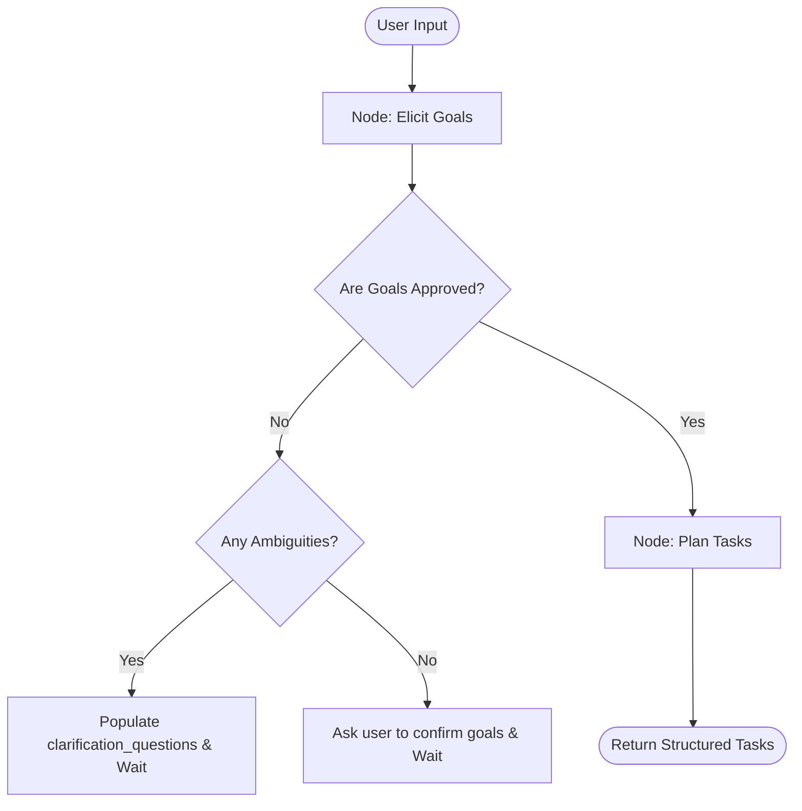

# AI Project Manager Architecture Specification

This document consolidates the layered architecture specifications for the AI Project Manager chatbot system. It serves as an immutable handoff for downstream developer agents.

---

## 1. Database Layer

This document defines database schemas, relational models, and caching strategies.

## Relational Schema (PostgreSQL)

To persist the project breakdown generated by the LangGraph coordinator and ensure integrity:

### 1. `users` Table
Stores human developer team members.
```sql
CREATE TABLE users (
    id VARCHAR(50) PRIMARY KEY,
    name VARCHAR(100) NOT NULL,
    email VARCHAR(100) UNIQUE NOT NULL,
    avatar_url VARCHAR(255),
    created_at TIMESTAMP WITH TIME ZONE DEFAULT CURRENT_TIMESTAMP
);
```

### 2. `tasks` Table
Stores task details and current execution status.
```sql
CREATE TYPE task_status AS ENUM ('todo', 'in_progress', 'done');
CREATE TYPE task_priority AS ENUM ('low', 'medium', 'high', 'critical');

CREATE TABLE tasks (
    id VARCHAR(50) PRIMARY KEY,
    project_id VARCHAR(50) NOT NULL REFERENCES projects(id) ON DELETE CASCADE,
    title VARCHAR(255) NOT NULL,
    description TEXT NOT NULL,
    status task_status DEFAULT 'todo',
    assignee VARCHAR(50) REFERENCES users(id) ON DELETE SET NULL,
    priority task_priority DEFAULT 'medium',
    estimated_effort VARCHAR(100) NOT NULL,
    created_at TIMESTAMP WITH TIME ZONE DEFAULT CURRENT_TIMESTAMP,
    updated_at TIMESTAMP WITH TIME ZONE DEFAULT CURRENT_TIMESTAMP
);

CREATE INDEX idx_tasks_project_id ON tasks(project_id);
```


### 3. `task_dependencies` Table
A self-referencing junction table to establish many-to-many dependency relations between tasks.
```sql
CREATE TABLE task_dependencies (
    task_id VARCHAR(50) NOT NULL REFERENCES tasks(id) ON DELETE CASCADE,
    depends_on_id VARCHAR(50) NOT NULL REFERENCES tasks(id) ON DELETE CASCADE,
    PRIMARY KEY (task_id, depends_on_id),
    CONSTRAINT chk_no_self_dependency CHECK (task_id <> depends_on_id)
);

CREATE INDEX idx_task_dependencies_task_id ON task_dependencies(task_id);
CREATE INDEX idx_task_dependencies_depends_on ON task_dependencies(depends_on_id);
```

---

## 2. API Layer

This document defines route contracts, endpoint payloads, and authentication.

## Project Management Endpoints

### 1. Goal Confirmation & Transition
* **Endpoint**: `POST /api/projects/:project_id/approve-goals`
* **Description**: Deterministically sets the `goals_approved` state to `True` for the LangGraph execution thread and triggers the task planning node.
* **Headers**:
  * `Content-Type: application/json`
* **Response (200 OK)**:
  ```json
  {
    "project_id": "string",
    "goals_approved": true,
    "status": "planning_tasks",
    "tasks": []
  }
  ```
* **Error Responses**:
  * `400 Bad Request`: If goals are already approved or there are unresolved clarification questions in the current state.
  * `404 Not Found`: If the project or thread does not exist.

### 2. Goal Rejection & Modification Loop
* **Endpoint**: `POST /api/projects/:project_id/reject-goals`
* **Description**: Sets the `goals_approved` state to `False` and resets the routing focus back to conversational elicitation, prompting the user for modifications.
* **Headers**:
  * `Content-Type: application/json`
* **Response (200 OK)**:
  ```json
  {
    "project_id": "string",
    "goals_approved": false,
    "status": "eliciting_goals",
    "message": "Modification loop initiated."
  }
  ```

### 3. Transition to Analysis / Finish Sharing
* **Endpoint**: `POST /api/projects/:project_id/finish-sharing`
* **Description**: Transitions the state's `elicitation_phase` from `"listening"` to `"stress_testing"`, initiating requirements gap-detection.
* **Response (200 OK)**:
  ```json
  {
    "project_id": "string",
    "elicitation_phase": "stress_testing",
    "detected_gaps": []
  }
  ```

### 4. Unlock Requirements Post-Approval
* **Endpoint**: `POST /api/projects/:project_id/unlock-requirements`
* **Description**: Resets the state's `elicitation_phase` back to `"listening"` and `goals_approved` to `False`, allowing the user to add more requirements.
* **Response (200 OK)**:
  ```json
  {
    "project_id": "string",
    "elicitation_phase": "listening",
    "goals_approved": false
  }
  ```

---

## 3. Services Layer

This document defines business logic handlers, domain boundaries, and workers.

## LangGraph State & Coordinator Agent

To support the conversation-driven project planning workflow, the central coordinator agent relies on a structured state schema to manage the message history, high-level project goals, generated tasks, and active elicitation questions.

### State Schema
```python
from typing import Annotated, List, TypedDict, Optional
from langchain_core.messages import BaseMessage
from langgraph.graph.message import add_messages
from pydantic import BaseModel, Field

from enum import Enum

class TaskStatus(str, Enum):
    TODO = "todo"
    IN_PROGRESS = "in_progress"
    DONE = "done"

class TaskPriority(str, Enum):
    LOW = "low"
    MEDIUM = "medium"
    HIGH = "high"
    CRITICAL = "critical"

class Task(BaseModel):
    id: str = Field(description="Unique task identifier, e.g., 'TSK-001'")
    title: str = Field(description="Brief title of the task")
    description: str = Field(description="Detailed scope of the work")
    status: TaskStatus = Field(default=TaskStatus.TODO)
    assignee: Optional[str] = Field(default=None, description="User ID of the assigned human developer")
    priority: TaskPriority = Field(default=TaskPriority.MEDIUM)
    estimated_effort: str = Field(description="Estimated effort (e.g. '3 hours', 'Medium')")
    dependencies: List[str] = Field(default_factory=list, description="IDs of tasks that must complete first")


class ProjectState(TypedDict):
    # LangGraph standard message history
    messages: Annotated[List[BaseMessage], add_messages]
    
    # Project Context
    project_id: str
    project_goals: str
    goals_approved: bool  # Explicit flag to check if the user has confirmed goals
    elicitation_phase: str  # "listening" | "stress_testing" | "goals_approved"
    
    # Structured data computed by agents
    tasks: List[Task]
    
    # Elicitation state
    clarification_questions: List[str]
    detected_gaps: List[str]  # Dynamic list of outstanding requirements gaps
    current_focus: Optional[str]  # e.g., "eliciting_goals", "planning_tasks", "idle"
```

### Key State Fields & Rationale
1. **`messages`**: Main conversation log. Appends incoming user messages and outgoing assistant messages. Using LangGraph's native `add_messages` reducer ensures historical context is preserved for system nodes.
2. **`project_goals`**: Raw, high-level goals captured during conversation. Enables the coordinator to synthesize and cross-reference tasks without parsing full message histories on every LLM call.
3. **`goals_approved`**: Explicit boolean flag. Serves as a gateway/guardrail. The graph will block any progression to task breakdown nodes until this is set to `True` (via user confirmation).
4. **`elicitation_phase`**: Tracks the user interaction workflow state. It partitions the session into:
   - `"listening"`: Coordinator listens patiently to raw client ideas without asking clarifying questions.
   - `"stress_testing"`: Coordinator locks the scope, checks for requirements gaps, and stress-tests details.
   - `"goals_approved"`: Requirements approved. Can be unlocked post-approval.
5. **`tasks`**: The list of structured tasks. As the coordinator breaks down goals, tasks are added or updated.
6. **`clarification_questions`**: A list of questions generated by the coordinator when requirements are ambiguous. When populated, the graph yields control (interrupt) to request user response.
7. **`detected_gaps`**: List of descriptive strings representing missing information or target ambiguities in requirements. Elicitation is complete when this is empty.
8. **`current_focus`**: Tracks the workflow node state to determine if the agent is actively gathering goals, drafting tasks, or waiting for input.


## Orchestration Flow & Transitions

The workflow executes in two distinct phases:



## State Updates & Resume Workflow

When the API layer receives a goal approval request, it bypasses conversational parsing and directly modifies the LangGraph thread state.

### Programmatic State Modification
The backend mutates the thread state using LangGraph's checkpointer interface:

#### 1. Goal Approval Pathway
```python
# Initialize graph configuration with thread ID
config = {"configurable": {"thread_id": project_id}}

# Force state transition, overriding 'goals_approved' and appending concluding message
concluding_msg = AIMessage(content="Got it! Starting your project now...")
await app.update_state(
    config, 
    {
        "goals_approved": True,
        "messages": [concluding_msg]
    }, 
    as_node="elicit_goals"
)

# Resume graph execution to process downstream nodes (Plan Tasks)
await app.ainvoke(None, config)
```

#### 2. Goal Rejection/Modification Pathway
```python
# Initialize graph configuration with thread ID
config = {"configurable": {"thread_id": project_id}}

# Force rejection state and reset to stress_testing focus
await app.update_state(
    config, 
    {
        "goals_approved": False,
        "elicitation_phase": "stress_testing",
        "current_focus": "eliciting_goals",
        "detected_gaps": ["User requested modifications to the summary"]
    }, 
    as_node="elicit_goals"
)
```
Using `as_node="elicit_goals"` ensures the state change is registered as if emitted by the elicitation node, satisfying the routing condition. Passing `None` to `ainvoke` resumes the graph from its last point.

## Dependency Validation & Cycle Prevention

To ensure that the coordinator agent does not generate circular dependencies (which would crash or infinite-loop down-stream workflow workers), a Depth-First Search (DFS) validation utility is integrated at the service layer:

```python
def validate_no_cycles(tasks: List[Task]) -> bool:
    """
    Returns True if the task list represents a valid Directed Acyclic Graph (DAG).
    Returns False if a circular dependency is detected.
    """
    adj = {t.id: t.dependencies for t in tasks}
    visited = {}  # 0: Unvisited, 1: Visiting, 2: Visited
    
    def has_cycle(node_id: str) -> bool:
        if visited.get(node_id) == 1:
            return True  # Found cycle
        if visited.get(node_id) == 2:
            return False
            
        visited[node_id] = 1
        for dep_id in adj.get(node_id, []):
            # Guard against invalid ID references
            if dep_id not in adj:
                continue
            if has_cycle(dep_id):
                return True
                
        visited[node_id] = 2
        return False

    for task in tasks:
        if has_cycle(task.id):
            return False
    return True
```
This validation is run in the post-processing phase of the `Plan Tasks` node. If a cycle is detected, the node regenerates the dependencies or defaults them to flat list ordering based on priority.

## Elicitation Framework & Dynamic Flow

The `Elicit Goals` node evaluates the user's project description against a dynamic "Gap-List" model, operating in two sequential phases:

### 1. The Listening Phase (`elicitation_phase == "listening"`)
* **Behavior**: The agent listens patiently and welcomes the client, allowing them to share their raw thoughts without interruption.
* **Rules**:
  * The agent summarizing user inputs and builds the draft `project_goals`.
  * The agent is strictly prohibited from listing gaps in `detected_gaps` or asking clarifying/stress-testing questions.
  * The agent's conversational response must ask if the user has more details to add (e.g., *"Got it. Is there anything else you'd like to share before we analyze this?"*).
  * This phase continues until the user clicks the "Begin Analysis" button (which triggers the API to switch `elicitation_phase` to `"stress_testing"`).

### 2. The Stress-Testing Phase (`elicitation_phase == "stress_testing"`)
* **Behavior**: The agent locks the addition of new requirements and shifts focus strictly to analyzing and clarifying the current scope.
* **Rules**:
  * The agent evaluates the collected information against the 4 vectors (**Core Intent, Data Scope, User Journey, Constraints**) and populates `detected_gaps` with outstanding questions.
  * The agent prompts the user with exactly **one** targeted question at a time to resolve the highest-priority gap in the list.
  * No new requirements or major scope additions are accepted; the focus is entirely on clarifying what was already shared.
  * When `detected_gaps` is empty `[]`, the elicitation is complete. The Side Panel opens to show the final preview for validation.

## Coordinator Agent System Prompt Template

The system prompt for the `Elicit Goals` node instructs the LLM to respect the active phase and maintain the state attributes.

```markdown
You are the Elicitation Coordinator Agent. Your core role is to guide the user in defining their project goals.

### 1. PHASE CONTROL RULES
You must read the `elicitation_phase` variable from the state and follow these rules strictly:

#### PHASE A: "listening"
- Welcome the user and listen to their raw thoughts.
- Update the `project_goals` summary field with what you understand so far.
- Do NOT populate `detected_gaps` or `clarification_questions`. Keep them empty `[]`.
- Do NOT ask technical questions or stress-test. Simply check if the user has anything else to add.

#### PHASE B: "stress_testing"
- Lock requirements. Do not allow adding new features outside the current scope.
- Analyze the draft goals for ambiguities and populate `detected_gaps` under four vectors (Core Intent, Data Scope, User Journey, Constraints).
- Ask exactly ONE clear question at a time to resolve the highest-priority gap.
- When all gaps are resolved, set `detected_gaps` and `clarification_questions` to empty lists `[]`.

### 2. THE FOUR VECTORS
1. **Core Intent**: Project target value, business/project objectives, and scope constraints.
2. **Data Scope**: Required input fields, database models/schemas, output payloads, and external sources.
3. **User Journey**: User roles, visual/interaction flow steps, and key state changes.
4. **Constraints**: Third-party APIs, performance budgets, authentication standards, and deployment limitations.

### 3. OUTPUT SPECIFICATION
You must output a JSON block matching the schema below to update the state, followed by your public message.

State update payload format:
{
  "detected_gaps": [
    "Descriptive string of gap 1",
    "Descriptive string of gap 2"
  ],
  "clarification_questions": [
    "One specific question to resolve the highest-priority gap (only during stress_testing phase)."
  ],
  "project_goals": "Structured markdown summary compiled by you for validation. You MUST use exactly three third-level headings: ### What We Have Done / Finalized, ### What Needs to Be Done / Next Steps, and ### What to Update. Use the value 'None' if a heading has no content."
}

### 4. ELICITATION RULES
- Focus: Ask exactly ONE clear question at a time (only in stress_testing).
- Do NOT make assumptions for incomplete details. If unspecified, list it as a gap.
- **Strict Separation of Public Message**: Your public message to the user MUST NOT contain any JSON, raw gaps, or 🟢/🟡/🔴 indicators. Output those strictly in the JSON state payload. Keep the public message conversational, natural, and helpful.
```

---

## 4. Frontend Layer

This document defines UI component trees, page routing, and client states.

## Component Layout & Interactions

### 1. Chat Component (`ChatConsole`)
* **State variables**:
  * `messages`: Array of chat messages.
  * `goals_approved`: Boolean.
  * `elicitation_phase`: String (`"listening"` or `"stress_testing"`).
  * `detected_gaps`: Array of strings (kept strictly in the background; not displayed to the user).
  * `is_planning`: Boolean (tracks if the backend is actively executing graph nodes).
* **Render Logic**:
  * Displays a standard chat log history.
  * **Zero-State Welcome Prompt**: If `messages.length == 0`, the console welcomes the client and invites them to share their project details.
  * **"Begin Analysis" Button**: Renders next to the chat input field *only* when `elicitation_phase == "listening"`. Clicking it triggers `POST /api/projects/:project_id/finish-sharing` to lock the listening phase and start stress-testing.
  * **Input Locking**: If `goals_approved == true`, the text input field is completely disabled (locked), showing: *"Requirements approved."*
  * Disable input message field and show a loading spinner when `is_planning == true`.


### 2. Side Panel Component (`SidePanel`)
* **Layout Structure**:
  * Occupies the right portion of the screen (collapsible or split-pane layout).
* **State & View Transitions**:
  1. **Idle/Listening State**:
     * *Trigger*: `elicitation_phase == "listening"`.
     * *UI Content*: Minimally rendered; displays a placeholder message: *"Listening and mapping your project requirements..."*.
  2. **Conversational Review & Approval State**:
     * *Trigger*: `elicitation_phase == "stress_testing"` AND `detected_gaps.length == 0` AND `goals_approved == false`.
     * *UI Content*: Slides open to present a client-friendly, easy-to-understand review summary:
       * **What We Have Done / Finalized**: Structured list of approved features/goals.
       * **What Needs to Be Done / Next Steps**: A simplified overview of the build plan in plain English.
       * **What to Update**: Areas flagged for refinement.
       * **Action Buttons**:
         * **"Approve Requirements & Goals"** (Button 1): Triggers `POST /api/projects/:project_id/approve-goals` to complete the phase.
         * **"That's not what I wanted, modify"** (Button 2): Triggers `POST /api/projects/:project_id/reject-goals` to return focus to chat and request adjustments.
  3. **Approved / Locked State**:
     * *Trigger*: `goals_approved == true`.
     * *UI Content*: Shows the finalized preview and renders:
       * **"Add More Requirements" Button**: Clicking it triggers `POST /api/projects/:project_id/unlock-requirements`, setting `goals_approved = false` and `elicitation_phase = "listening"`, allowing the user to type new features in the chat thread.
