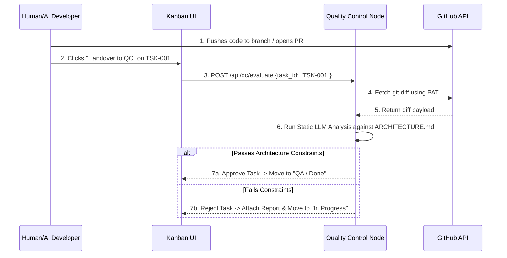

# Developer Node Architecture (Execution & Validation)

This document defines the architecture for the `developer_node`, a sibling module to the `chatbot_v2` (Planning Node). While the planning node generates tasks and architectural blueprints, this node handles code execution, Quality Control (QC), and Quality Assurance (QA).

## 1. System Overview
The `developer_node` acts as an automated CI/CD pipeline integrated directly into the AI Project Manager's Kanban board. It evaluates human or AI-generated code against the strict constraints outlined in `ARCHITECTURE.md` (and its sub-layers).

## 2. Core Decisions & Constraints

### A. Integration & Triggers (Manual UI-Driven)
- **No Webhooks or Polling:** The system does not actively monitor GitHub or the local file system.
- **Trigger Mechanism:** Execution is triggered exclusively via the Kanban UI. The developer clicks a "Code Pushed: Handover to QC" button on a specific task card.
- **Payload:** The UI passes the explicit Task ID (e.g., `TSK-001`) and the current branch/commit context to the QC FastAPI backend.

### B. Security & Authentication (GitHub PAT)
- **Auth Strategy:** The system uses a GitHub Personal Access Token (PAT).
- **Storage:** The PAT is stored securely in the `developer_node/backend/.env` file (`GITHUB_PAT=ghp_...`).
- **Usage:** This token allows the QC Node to use the GitHub API to fetch the exact `git diff` associated with the task's Pull Request or branch.

### C. Data Integrity (Context Linkage)
- **Traceability:** Because the trigger originates from the Kanban UI, there is a guaranteed 1:1 mapping between the submitted code and the task requirements.
- **Retrieval:** The QC Node uses the passed Task ID to look up the exact acceptance criteria and dependencies assigned by the `chatbot_v2` planner.

### D. Execution Environment (Static Analysis)
- **Testing Approach:** Static Analysis via LLM.
- **Mechanism:** The QC Node pulls the raw text of the `git diff`. It does **not** spin up Docker containers, run build scripts, or execute the code.
- **Evaluation:** The LLM acts as a Senior Code Reviewer. It reads the diff and cross-references it against:
  1. The specific Task requirements.
  2. The constraints defined in `architecture/DB_LAYER.md`, `API_LAYER.md`, etc.
- **Outcome:** It either approves the code (moving the Kanban card to "Done") or rejects it, attaching a detailed Markdown report of architectural violations to the card.

## 3. Workflow Diagram

## 4. Next Implementation Steps
1. **Initialize `developer_node` FastApi backend:** Set up routes (`/api/qc/evaluate`).
2. **GitHub API Client:** Write the service to fetch diffs using the PAT.
3. **LangGraph QC Agent:** Build the static analysis node that ingests the diff and the architectural layer files.
4. **UI Integration:** Add the "Handover to QC" button to the existing Kanban board in `chatbot_v2` and wire it to the new `developer_node` endpoints.
